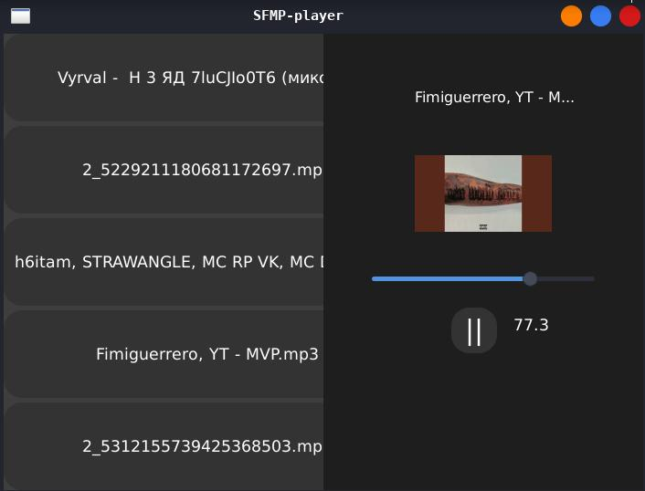

# SFMP-player
This is GTK music player, for linux


screenshot

# TODO:
- [x] Modern interface (BETA)
- [x] Playing music
- [x] Extract icons (BETA)
- [x] CLI
- [ ] Plugins
- [ ] More music format

# Format audio file
- [x] MP3
- [x] WAV

# How to install?
To download SFMP, you need to assemble it:

```bash
git clone https://github.com/Nos0kkk/SFMP.git
cd SFMP
```
# Next for the build
***Arch Linux***
```bash
./build.sh --linux-arch
```
***Fedora Linux***
```bash
./build.sh --linux-fedora
```
***Debain/Ubuntu/Kali/Mint/Astra/Tails/...***
```bash
./build.sh --linux-debian
```
***Alpine Linux***
```bash
./build.sh --linux-alpine
```
***Void Linux***
```bash
./build.sh --linux-void
```
***Termux (Android)***
```bash
./build.sh --android-termux
```

# BETA v1.0
